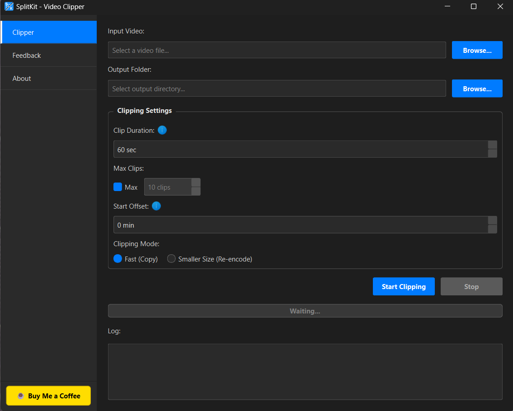
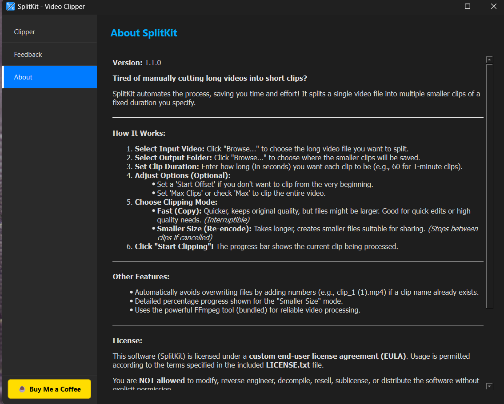
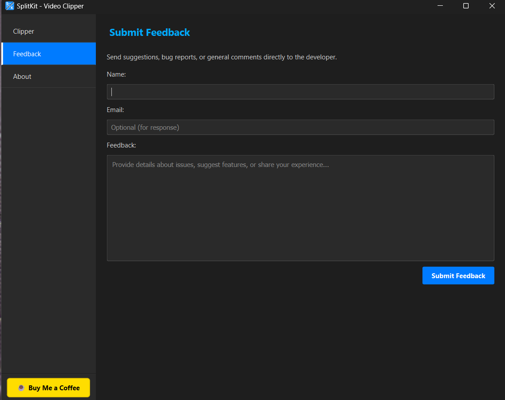

# SplitKit
Auto video splitting tool for creators

  

<h1 align="center">🎬 SplitKit</h1>

<strong>Smart. Fast. Effortless video splitting for content creators, analysts, and archivists.</strong>

  
  
  

---

## 🎥 What is SplitKit?

> **SplitKit** helps you **automatically cut long videos** into smaller, fixed-duration clips — in seconds.  
> No editing software. No headaches. Just clean clips — ready for upload, review, or archive.

---

## ✨ Key Features

- 🧠 **Two Clipping Modes**
  - **Fast Copy:** Lightning-fast, lossless, ideal for archiving.
  - **Re-encode:** Compressed clips, perfect for sharing or social media.
- 🎛️ **Custom Controls**
  - Set duration, start offset, and clip limit.
- 🖥️ **Responsive Interface**
  - Multithreaded clipping with real-time UI feedback.
- 💬 **Built-in Feedback Form**
- 🚀 **Smart Update Checker**
- 🧠 **Auto File Naming**
- 🧰 **Bundled FFmpeg (No Setup Needed)**

---

## 📸 Preview

| Main View | About Tab | Feedback |
|----------|-----------|----------|
|  |  |  |

> (Optional) Replace with animated GIF preview:  
> ``

---

## 🖥️ System Requirements

| Item | Requirement |
|------|-------------|
| OS   | Windows 10/11 (64-bit recommended) |
| FFmpeg | ✅ Bundled — no separate install |

---

## 🚀 Installation Guide

1. Head to the [**Latest Release**](https://github.com/void032/SplitKit/releases/latest)
2. Download the `.exe` from the **Assets** section
3. Double-click the installer and follow prompts
4. Launch from Desktop or Start Menu

> 💡 On first run, Windows might show a **SmartScreen Warning**. Click "More info" → "Run anyway".

---

## 🧪 How to Use

1. Open **SplitKit**
2. Load your long video
3. Choose output folder
4. Set clip duration (seconds)
5. Choose mode: Fast or Re-encode
6. Hit `Start Clipping` 🎬
7. Relax. We’ll take it from here.

---

## 🛠️ Tech Stack

| Component | Purpose |
|----------|---------|
| **Python + PyQt6** | GUI & backend |
| **MoviePy** | Re-encoding |
| **FFmpeg** | Core video splitting |
| **Requests** | Update checks & feedback |
| **Inno Setup** | Installer generation |

---

## 🆙 Update Mechanism

SplitKit checks for updates at launch (if internet is available).  
A clickable sidebar link will appear if a newer version exists.

---

## 💬 Feedback & Support

Have a feature idea or found a bug?

- Open a [GitHub Issue](https://github.com/void032/SplitKit/issues)
- Or use the in-app **Feedback** form
- Feeling generous?  
  👉 [Buy Me a Coffee ☕](https://buymeacoffee.com/void1)

---

## 📜 License

**SplitKit Application:**

- Licensed under the **SplitKit Software License Agreement** (see `LICENSE.txt`).
- Proprietary software: no redistribution, resale, or modification without permission.

**Bundled Tools:**

- **FFmpeg / ffprobe**: Licensed under  
  `📜 [ffmpeg_LICENSE.txt]`  
  License files included in install directory.

---

## 🙏 Credits

- 👨‍💻 Developed by: **Void**
- ⚙️ Built with: Python, PyQt6, MoviePy, FFmpeg
- 🧠 Inspiration: The creator’s desire to eliminate repetitive, time-wasting video editing workflows.

---

  <em>Split smarter. Create faster. Your content deserves it.</em>

